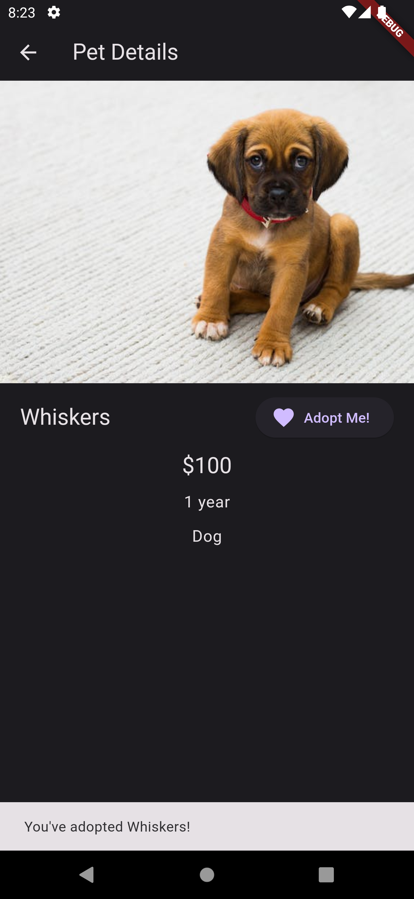

# Adopt a Pet App

## Table of Contents

- [Description](#description)
- [Technologies](#technologies)
- [Screenshots](#screenshots)
- [Installation](#installation)
- [Usage](#usage)
- [Author](#author)

## Description

This is a simple app that allows users to adopt a pet. The app is built using Flutter and Bloc state management. The app is built using the following technologies:

## Technologies

- Flutter
- Bloc

## Screenshots

<body>
<table>
<thead>
<tr>
<th>Home Page - Dark Mode</th>
<th>Home Page - Light Mode</th>
<th>Details Page</th>
</tr>
</thead>
<tbody>
<tr>
<td></td>
<td></td>
<td></td>
</tr>
</tbody>
</table>
</body>

## Installation

To run the app, you need to have Flutter installed on your machine. If you don't have Flutter installed, you can follow the instructions [here](https://flutter.dev/docs/get-started/install).

After installing Flutter, you can clone the repository and run the following command to install the dependencies:

```bash
flutter pub get
```

## Usage

To run the app, you can use the following command:

```bash
flutter run
```

## Author

- [Mohammed Azam](https://linkedin.com/in/azam5)
